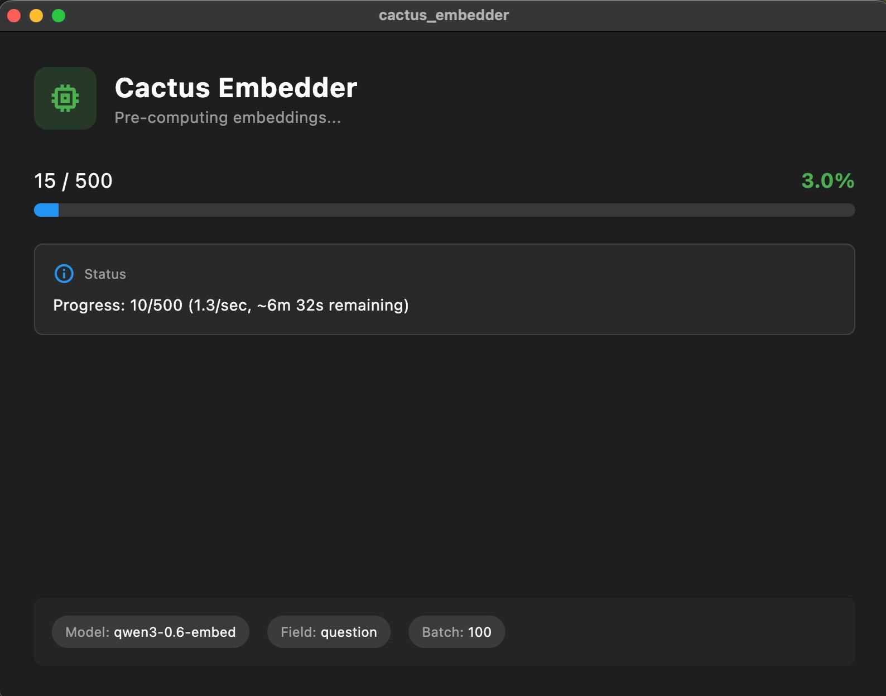

# Cactus Embedder

Pre-compute embeddings for [Cactus SDK](https://pub.dev/packages/cactus) apps. Supports JSON and PDF.



## Why This Exists

We built a maternal health app for Ghana. It uses the [Ghana Maternal Health Twi-English Q&A Dataset](https://www.kaggle.com/datasets/ghanaairesnet/ghana-maternal-health-twi-english-q-and-a-dataset) (20,000 Q&A pairs) released by Ghana AI Research Network.

Problem: generating embeddings at startup takes hours. Users won't wait.

Solution: pre-compute at build time, ship with the app.

### Why not Python?

Different models produce incompatible vectors. Embeddings from `sentence-transformers` won't work with Cactus's `qwen3-0.6-embed`. Must use the same model for pre-computing and runtime.

### Why not a Dart CLI?

Cactus SDK needs Flutter's platform channels. Pure Dart can't do this.

## Features

- JSON and PDF support
- Checkpointing (saves every 100 items)
- Resume interrupted jobs
- Multiple models (`qwen3-0.6-embed`, `nomic-embed-text-v2`)

## Install

```bash
git clone https://github.com/anthropics/cactus_embedder.git
cd cactus_embedder
flutter pub get
```

## Usage

### JSON

```bash
flutter run -d macos -- -i qa_pairs.json -o output.json

# Custom text field
flutter run -d macos -- -i data.json -o out.json --text-field content
```

### PDF

```bash
flutter run -d macos -- -i document.pdf -o output.json --input-type pdf

# Directory of PDFs
flutter run -d macos -- -i ./docs/ -o output.json --input-type pdf-dir
```

### Options

| Option | Default | Description |
|--------|---------|-------------|
| `-i, --input` | Required | Input file/directory |
| `-o, --output` | Required | Output JSON path |
| `--input-type` | `json` | `json`, `pdf`, or `pdf-dir` |
| `-m, --model` | `qwen3-0.6-embed` | Embedding model |
| `-t, --text-field` | `question` | JSON field to embed |
| `-c, --chunk-size` | `500` | PDF chunk size (chars) |
| `--chunk-overlap` | `50` | Overlap between chunks |
| `-b, --batch-size` | `100` | Checkpoint interval |

## Output

```json
{
  "qa_pairs": [
    {
      "id": "Q001",
      "question": "What is maternal health?",
      "answer": "...",
      "embeddings": [0.123, -0.456, ...]
    }
  ],
  "_embedder_metadata": {
    "model": "qwen3-0.6-embed",
    "total_items": 20000,
    "generated_at": "2025-01-15T10:30:00Z"
  }
}
```

## Loading in Your App

```dart
final jsonString = await rootBundle.loadString('assets/qa_with_embeddings.json');
final data = json.decode(jsonString);

for (final qa in data['qa_pairs']) {
  final item = QAPair()
    ..question = qa['question']
    ..answer = qa['answer']
    ..embeddings = List<double>.from(qa['embeddings']);
  box.put(item);
}
```

## Performance

On Apple Silicon:

| Model | Speed | 20K Items |
|-------|-------|-----------|
| qwen3-0.6-embed | ~1-2/sec | ~3-6 hours |
| nomic-embed-text-v2 | ~2-3/sec | ~2-3 hours |

Checkpointing lets you pause and resume anytime.

## Roadmap

- [ ] Batch processing (multiple files)
- [ ] Parallel processing (multi-core)
- [ ] Direct vector DB export

## Platform Support

macOS, Linux, Windows. Requires Flutter SDK.

## License

MIT
